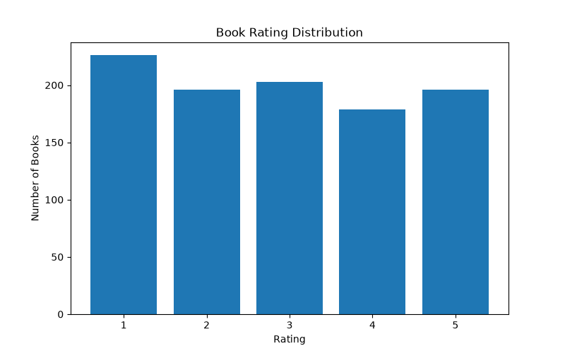
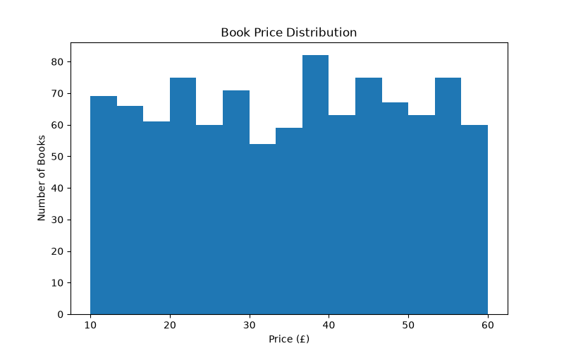
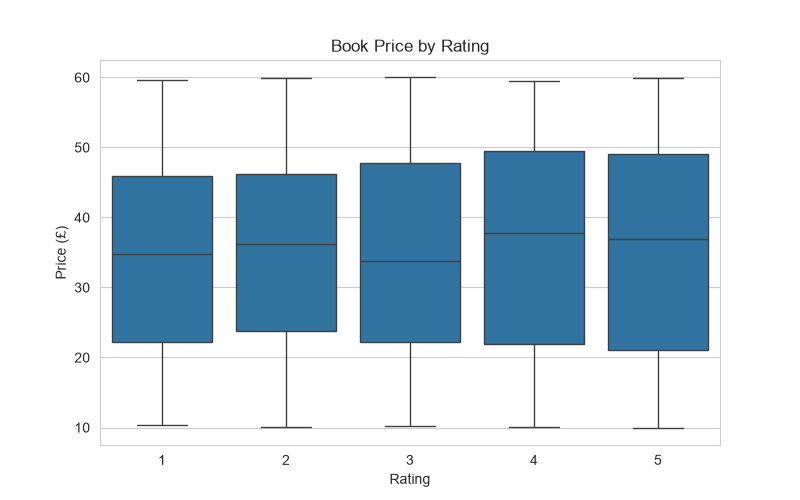
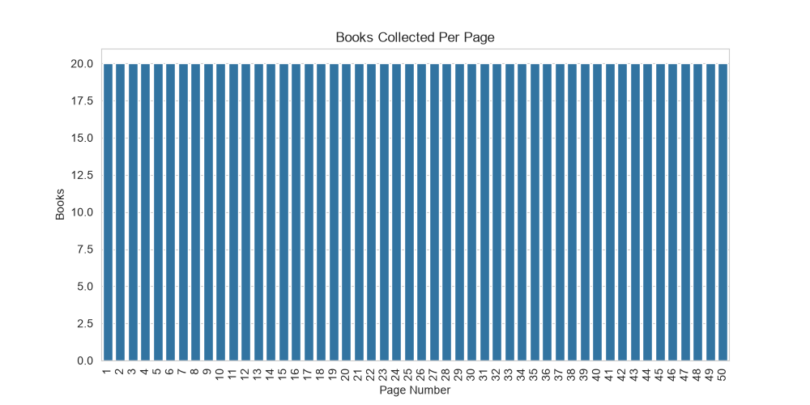
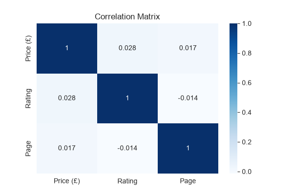

# 📊 Exploratory Data Analysis (EDA) on Books Dataset

## 📌 Project Overview

This project performs **Exploratory Data Analysis (EDA)** on a books dataset collected through web scraping. The objective is to understand the dataset, identify trends and patterns, detect anomalies, and evaluate data quality using statistical analysis and visualizations.

---

## 🎯 Objectives

- Ask meaningful questions before analysis.
- Explore dataset structure and variables.
- Analyze data types and summary statistics.
- Identify trends, patterns, and anomalies.
- Validate assumptions using statistics and visualizations.
- Detect missing values and duplicate records.

---

## 🛠️ Technologies Used

- Python 3.13
- Pandas
- Matplotlib
- Seaborn

---

## 📂 Dataset Information

**Dataset:** `books_dataset.csv`

| Feature | Description |
|---------|-------------|
| Title | Name of the book |
| Price (£) | Price of the book |
| Availability | Stock availability |
| Rating | Book rating (1–5) |
| Page | Web page number |

**Dataset Summary**

- Total Records: **1000**
- Total Features: **5**
- Source: Books to Scrape

---

## ❓ Questions Asked

Before starting the analysis, the following questions were considered:

- How many books are available?
- What is the average price of books?
- Which book is the most expensive?
- Which book is the least expensive?
- Which rating appears most frequently?
- Are there missing values?
- Are there duplicate records?
- Does a higher rating correspond to a higher price?
- Are there any unusual price values (outliers)?

---

## 🔍 EDA Process

The following analyses were performed:

- Dataset Preview
- Data Structure Analysis
- Data Type Inspection
- Missing Value Analysis
- Duplicate Record Detection
- Summary Statistics
- Trend Analysis
- Pattern Identification
- Correlation Analysis
- Outlier Detection
- Data Quality Assessment

---

# 📈 Visualizations

## 1️⃣ Rating Distribution

Shows the number of books in each rating category.



---

## 2️⃣ Price Distribution

Shows how book prices are distributed.



---

## 3️⃣ Price vs Rating

Compares book prices across different rating categories.



---

## 4️⃣ Books per Page

Shows the number of books collected from each webpage.



---

## 5️⃣ Correlation Heatmap

Displays the correlation between numerical variables.



---

## 📊 Key Findings

- Successfully analyzed **1000 books** collected from **50 pages**.
- Average book price is approximately **£35.07**.
- Book prices range from **£10.00** to **£59.99**.
- Ratings vary between **1 and 5**.
- No missing values were found.
- No duplicate records were detected.
- The dataset is clean and ready for further analysis or machine learning.

---

## 📖 Insights

- Most books fall within a moderate price range.
- Ratings are distributed across all five categories.
- Price varies among different rating groups.
- Correlation analysis provides insight into relationships among numerical variables.
- Data quality checks confirm that the dataset is complete and reliable.

---

## 🚀 How to Run

### 1. Install Required Libraries

```bash
pip install -r requirements.txt
```

### 2. Run the EDA Script

```bash
python eda.py
```

### 3. View Results

All generated charts are stored inside the **eda_outputs/** folder.

---

## 📁 Project Structure

```
Task2_EDA/
│
├── books_dataset.csv
├── eda.py
├── README.md
│
└── eda_outputs/
    ├── rating_distribution.png
    ├── price_distribution.png
    ├── price_vs_rating.png
    ├── books_per_page.png
    └── correlation_heatmap.png
```

---

## 📚 Learning Outcomes

Through this project, the following skills were demonstrated:

- Exploratory Data Analysis (EDA)
- Data Cleaning
- Data Validation
- Statistical Analysis
- Trend Analysis
- Pattern Recognition
- Outlier Detection
- Data Visualization using Matplotlib and Seaborn
- Data Quality Assessment

---

## 👨‍💻 Author

**Sarthak Bhangade**

B.Tech – Artificial Intelligence & Data Science

---

## 📄 License

This project is created for educational and internship purposes.
